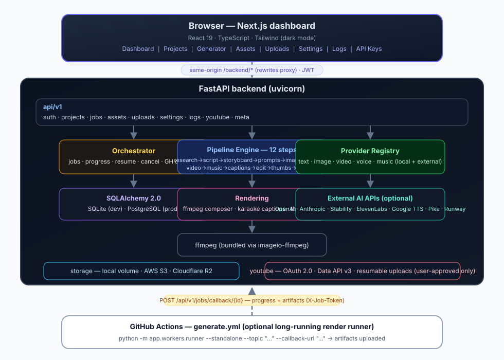

# 🎬 AI Kids Video Studio

Turn a simple topic — **"ABCs"**, **"Dinosaurs"**, **"Colors"** — into a complete,
reviewed, kid-safe educational video. The studio researches the topic, writes an
original script, builds a storyboard, renders animation with a consistent mascot,
synthesizes narration, composes original royalty-free music, syncs animated
captions, edits everything into a polished video, designs thumbnails, writes SEO
metadata — and then **waits for your approval** before anything is uploaded to
YouTube.

> **Not a prototype.** Modular architecture, pluggable AI providers, JWT auth,
> encrypted API keys, Docker packaging, CI/CD, E2E tests, resumable jobs, and a
> full review-and-approve workflow. **Nothing is ever uploaded automatically.**



---

## ✨ Highlights

| Area | What's inside |
| --- | --- |
| **Pipeline** | 12-step production workflow: research → script → storyboard → scene prompts → images → voice → video → music → captions → editing → thumbnails → preview |
| **Approval gate** | YouTube upload happens only after the user explicitly presses **Approve Upload** and confirms |
| **Offline-capable** | Built-in providers (writer, illustrator, motion engine, voice, composer) produce a real MP4 with **zero API keys** |
| **Provider system** | Swap OpenAI / Anthropic / Stability / ElevenLabs / Google TTS / Pika / Runway per capability on the Settings page |
| **Character consistency** | A seeded character sheet is injected into every prompt and every local render — same mascot, colors and style across all scenes |
| **Quality gates** | Global negative prompts (no morphing/flickering/extra limbs/text artifacts), clip duration planning, seamless crossfades, loudness normalization, kid-safe content rules |
| **Projects** | Multi-project dashboard, resumable jobs, asset library, logs, upload history |
| **Deployment** | Docker Compose (SQLite dev / PostgreSQL prod), local disk / S3 / Cloudflare R2 storage, GitHub Actions for long-running renders |

## 🧱 Tech Stack

- **Frontend** — Next.js 15, React 19, TypeScript, TailwindCSS, dark mode, mobile-friendly responsive dashboard
- **Backend** — FastAPI (Python 3.11+), SQLAlchemy 2, Pydantic v2
- **DB** — SQLite (dev) / PostgreSQL (prod)
- **Auth** — JWT (PBKDF2-hashed passwords), per-user encrypted API keys (Fernet)
- **Media** — ffmpeg (self-contained via `imageio-ffmpeg`), Pillow, NumPy, SciPy
- **Storage** — local disk, AWS S3, Cloudflare R2
- **YouTube** — official Data API v3, OAuth 2.0, resumable uploads with retries, thumbnail upload, scheduling, made-for-kids flags
- **CI/CD** — GitHub Actions (lint+tests, Docker images, long-running render workflow)

---

## 🚀 Quick Start

### Option 0 — One-click local launcher (Windows/macOS/Linux, no Docker)

Requires only **Python 3.10+** and **Node.js 18+** on your machine:

```bash
./run-local.sh       # macOS / Linux
run-local.bat        # Windows (or just double-click it)
```

It installs everything, builds the frontend, starts both servers and opens
http://localhost:3000 for you. Register any account on the login page.

### Option A — Docker (one command)

```bash
cp .env.example .env          # then edit SECRET_KEY
docker compose up --build
# frontend → http://localhost:3000   backend API → http://localhost:8000/docs
```

### Option B — Local dev (no Docker)

```bash
# --- terminal 1: backend ---
cd backend
python -m venv .venv && source .venv/bin/activate
pip install -r requirements-dev.txt
cp ../.env.example .env       # edit SECRET_KEY
uvicorn app.main:app --reload --host 0.0.0.0 --port 8000

# --- terminal 2: frontend ---
cd frontend
npm install
npm run dev                   # http://localhost:3000
```

Open <http://localhost:3000>, create an account, go to **Video Generator**,
type **ABCs**, press **Generate Video** — and watch the live pipeline tracker.
Within a few minutes you get a fully rendered video on the Preview page.

No API keys are required for a full run: the built-in providers (offline
writer, illustrator, motion engine, voice synth and music composer) handle
everything. Add provider keys later on the **API Keys** page for richer
visuals and natural voices.

## 🗺️ Pages

| Page | Purpose |
| --- | --- |
| **Dashboard** | Overview stats, recent projects, activity |
| **Projects** | All productions with status filters |
| **Video Generator** | Topic, age, length, style, animation, voice, language, music, aspect ratio → live 13-step tracker |
| **Project / Preview** | Video player, script editor, storyboard, prompts & character sheet, thumbnails, captions, metadata, regeneration buttons, **Approve Upload** |
| **Assets** | Every image, clip, voice, music, caption, thumbnail the pipeline made |
| **Uploads** | YouTube upload history, statuses, retry, refresh |
| **Settings** | Provider selection per capability, YouTube OAuth connect |
| **Logs** | Full audit trail with filters |
| **API Keys** | Encrypted key management per provider |

## 🔁 The Generation Pipeline

Every step is persisted, logged and resumable:

1. **Research** — curated knowledge base (learning objectives, vocabulary, facts, teaching points) or structured generic research for any topic
2. **Script** — original, conversational, age-tuned writing with hooks, questions, tiny stories, fun facts, transitions and encouragement; word-budgeted to fit the requested length
3. **Storyboard** — scene-by-scene plan: narration, visual, camera, animation, duration
4. **Scene Prompts** — per-scene image & video prompts + global negative prompt + the project character sheet (the consistency contract)
5. **Images** — one illustration per scene (offline storybook illustrator or external provider)
6. **Voice** — narration per scene with exact word-level timings, paced to the scene slot
7. **Video** — one animated clip per scene (Ken Burns / pans / float), as many clips as needed; external short-clip providers merge seamlessly the same way
8. **Music** — original loopable background track, mixed quietly under narration
9. **Captions** — SRT + ASS (karaoke word highlighting), synced from real narration timings
10. **Editing** — branded intro/outro, crossfades, narration mix, music bed, burned-in animated captions, loudness normalization (EBU R128), final MP4
11. **Thumbnails** — 3 high-contrast concepts optimized for CTR
12. **Preview** — SEO title, description with chapters, tags, hashtags, audience + disclosure; project moves to *Ready for Review*
13. **Upload** — always shows **Pending Approval** until you confirm

On the Preview page you can **edit the script**, **regenerate a single scene,
voice, music, thumbnails or the entire video**, and only then approve.

## 🎨 Consistency & Compliance by design

- A deterministic **character sheet** (seeded per project) pins the mascot's name,
  colors, belly, eyes, accessory, proportions and style rules. The same sheet is
  embedded in every external prompt and enforced by the local illustrator.
- **Negative prompts** across all scenes forbid morphing, flickering, warping,
  bad anatomy, text artifacts, style drift and copyrighted characters.
- Content rules are kid-safe by construction; uploads are set **made for kids**
  (COPPA) and default to **private drafts**.
- A **synthetic-media disclosure** is added to descriptions (fully animated
  educational content, no real people or events), aligning with YouTube's
  altered/synthetic content policy.
- Music is original & royalty-free (synthesized) or user-supplied licensed
  tracks only. The pipeline **creates original content** — it never downloads or
  remixes copyrighted video.

See [`docs/PROVIDERS.md`](docs/PROVIDERS.md) for the provider catalog and
extension guide, [`docs/YOUTUBE_SETUP.md`](docs/YOUTUBE_SETUP.md) for OAuth
setup, [`docs/DEPLOYMENT.md`](docs/DEPLOYMENT.md) for Render/Fly/Railway/Vercel/
Cloudflare deployment, [`docs/API.md`](docs/API.md) for the REST reference and
[`docs/ARCHITECTURE.md`](docs/ARCHITECTURE.md) for internals.

## 🧪 Tests & Quality

```bash
cd backend
ruff check app tests          # lint (zero warnings)
python -m pytest -m "not slow"  # 28 unit + API tests
python -m pytest tests/test_pipeline_e2e.py  # full offline render E2E
```

GitHub Actions (`ci/github-workflows/ci.yml`) runs lint + unit tests, the **full
offline render E2E** (produces a real MP4 on every push) and the Next.js build.
The `docker.yml` workflow builds both images; `generate.yml` is the
long-running render workflow the dashboard can dispatch to.
Workflow files ship under `ci/github-workflows/` — move them to
`.github/workflows/` once to activate (see [`ci/README.md`](ci/README.md);
the delivery token lacked GitHub's Workflows permission).

## 📦 Repository layout

```
yt/
├── frontend/            # Next.js dashboard (TypeScript, Tailwind)
├── backend/
│   ├── app/
│   │   ├── api/         # REST endpoints (auth, projects, jobs, uploads, ...)
│   │   ├── core/        # config, security, logging, rate limiting
│   │   ├── models/      # SQLAlchemy models
│   │   ├── schemas/     # Pydantic schemas
│   │   ├── services/
│   │   │   ├── pipeline/    # knowledge base, prompt builders, engine, orchestrator
│   │   │   ├── providers/   # pluggable AI providers (text/image/video/voice/music)
│   │   │   ├── rendering/   # captions, composer (final edit), thumbnails, ffmpeg
│   │   │   ├── storage/     # local / S3 / Cloudflare R2
│   │   │   └── youtube/     # OAuth + Data API v3 client
│   │   └── workers/     # standalone runner (GitHub Actions long jobs)
│   └── tests/
├── ci/github-workflows/ # CI, Docker, long-running generation (move to .github/workflows/ to activate)
├── docs/                # architecture, deployment, providers, API, YouTube setup
└── docker-compose.yml   # dev; + docker-compose.prod.yml (PostgreSQL)
```

## 🔐 Security notes

- Secrets come only from environment variables / your platform's secrets manager — never hardcoded (`.env.example` documents every key).
- Passwords are PBKDF2-HMAC-SHA256 hashed (600k iterations); sessions are short-lived JWTs.
- Provider API keys are stored **Fernet-encrypted** at rest and masked in all API responses.
- Rate limiting, input validation (Pydantic), security headers and a full audit log are built in.
- OAuth tokens for YouTube are stored encrypted per user; disconnect anytime.

## 📄 License

MIT — see [LICENSE](LICENSE).
